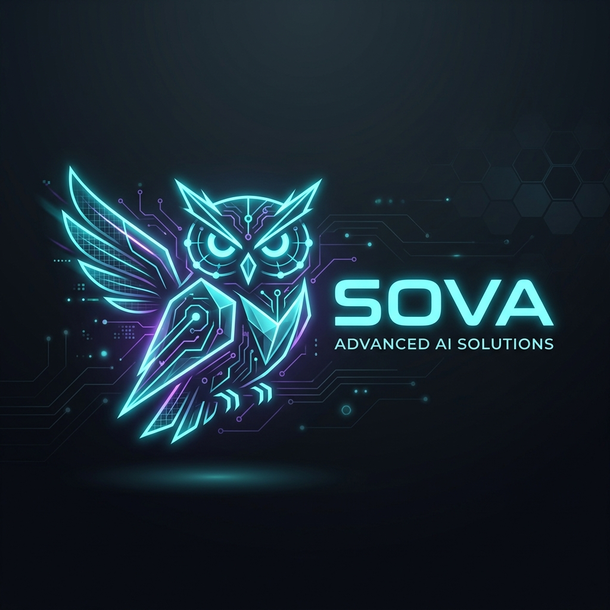

# <p align="center">🦉 SOVA YT_SUMMARIZER</p>

<p align="center">
  
</p>

<p align="center">
  
  
  
  
</p>

---

## 🌟 Обзор
**SOVA YT_SUMMARIZER** — это интеллектуальный сервис для мгновенного анализа и суммаризации YouTube-видео. Используя мощь **Gemini 3 Flash** и **Supadata**, приложение извлекает суть из любого видео, экономя часы вашего времени.

Данный проект является частью экосистемы **SOVA-PLAYGROUND** — набора инструментов для экспериментов с AI и современными веб-технологиями.

## ✨ Особенности
- **Терминальный интерфейс**: Уникальный хакерский стиль в духе ретро-футуризма.
- **Deep AI Analysis**: Не просто краткий пересказ, а выделение ключевых тезисов с таймкодами.
- **Real-time Logging**: Визуализация процесса обработки в реальном времени через интерактивный терминал.
- **Hybrid Stack**: Бесшовная интеграция Next.js фронтенда и FastAPI бэкенда.
- **Vercel Optimized**: Полностью готов к деплою в serverless окружение.

## 🛠 Технологический стек
- **Frontend**: React 19, Next.js (App Router), Tailwind CSS, Shadcn/UI.
- **Backend**: Python 3.12, FastAPI, Pydantic v2.
- **AI/API**: Google Gemini 3 Flash SDK, Supadata (Transcript extraction).

## 🚀 Быстрый старт

### 1. Клонирование репозитория
```bash
git clone https://github.com/alonyaska/SOVA-Summaraizer.git
cd SOVA-Summaraizer
```

### 2. Настройка Backend (Python)
```bash
cd api
python -m venv venv
source venv/bin/activate  # На Windows: venv\Scripts\activate
pip install -r requirements.txt
```

### 3. Настройка Frontend (Node.js)
```bash
cd ..
npm install # или pnpm install
```

### 4. Переменные окружения
Создайте файл `.env` в папке `api/`:
```env
SUPADATA_API_KEY=your_key_here
GEMINI_API_KEY=your_key_here
```

## 👨‍💻 Разработчик
Создано с любовью к коду и технологиям:
**[@alonyaska](https://github.com/alonyaska)**

---

<p align="center">
  <i>Part of the <b>SOVA-PLAYGROUND</b> ecosystem.</i>
</p>
